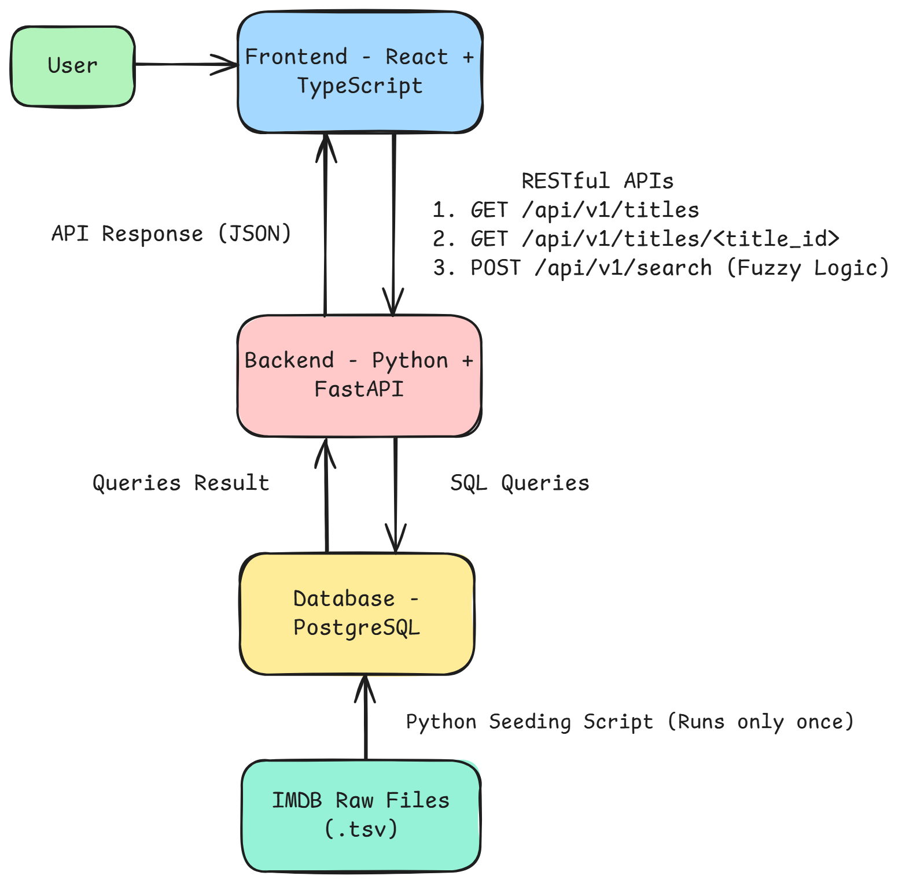

# Cageflix Frontend - React + TypeScript + Material UI

[Frontend is accessible here](https://cageflix-frontend-production.up.railway.app/)

A responsive frontend for Cageflix – a Netflix-style movie library dedicated exclusively to Nicolas Cage’s filmography.
Built with React, TypeScript, and Material UI, it offers intuitive navigation, fuzzy search capabilities, and seamless integration with the FastAPI backend.

---

## Table of Contents

- [Technology Choices & Rationale](#technology-choices--rationale)
- [Architecture Diagram](#architecture-diagram)
- [Project Structure & Purpose](#project-structure--purpose)
- [Setup Instructions](#setup-instructions)
- [Future Enhancements](#future-enhancements)

---

## Technology Choices & Rationale

| Technology         | Reasoning                                                 |
| ------------------ | --------------------------------------------------------- |
| React + TypeScript | Component-based, type-safe UI with wide ecosystem support |
| Material UI        | Pre-styled, accessible components consistent UI design    |
| Axios              | Clean HTTP requests with interceptors and error handling  |
| React Router       | Declarative client-side routing                           |
| Vite               | Lightning-fast development and optimized builds           |
| Railway            | Simple and efficient frontend hosting/deployment          |

---

### Architecture Diagram

---

## Project Structure & Purpose

CAGEFLIX-FRONTEND/  
│  
├── public/ # favicon
│  
├── src/ # Application source code  
│ ├── api/ # Axios API modules  
│ │ ├── axios.ts # Axios instance with base config  
│ │ ├── search.ts # Fuzzy search API methods  
│ │ └── titles.ts # Title endpoints (list/detail)  
│ │  
│ ├── assets/ # Static image assets  
│ │ └── cageflix-logo.png # Logo used in header  
│ │  
│ ├── components/ # Reusable UI components  
│ │ ├── AppBar.tsx # Top navigation bar  
│ │ ├── GenreChips.tsx # Genre filters (UI chip list)  
│ │ ├── ScrollToTop.tsx # Scroll-to-top handler on route change  
│ │ ├── SearchBar.tsx # Input field for search  
│ │ ├── TitleCard.tsx # Card layout for title previews  
│ │ └── TitleGrid.tsx # Grid layout for title lists  
│ │  
│ ├── hooks/ # Custom React hooks  
│ │ ├── useDebouncedSearch.ts # Handles debounced text input  
│ │ └── usePaginatedTitles.ts # Infinite scroll and pagination  
│ │  
│ ├── pages/ # Route-level components  
│ │ ├── Home.tsx # Landing page (search + highlights)  
│ │ ├── Movies.tsx # Movie list view  
│ │ ├── Shows.tsx # Show list view  
│ │ └── TitleDetail.tsx # Detailed view of a single title  
│ │  
│ ├── types/ # TypeScript types/interfaces  
│ │ ├── App.tsx # Global types and props  
│ │ └── vite-env.d.ts # Vite environment declarations  
│ │  
│ ├── App.tsx # Root component with routing logic  
│ └── main.tsx # React app entry point  
│  
├── .env.example # Example environment configuration  
├── .gitignore # Git ignore rules  
├── index.html # HTML base template  
├── package.json # Project manifest  
├── package-lock.json # Lock file for reproducibility  
├── tsconfig.json # TypeScript config  
├── vite.config.ts # Vite-specific configuration  
├── README.md # Project documentation

---

## Setup Instructions

1. Clone the Repository

   git clone https://github.com/HassnainKazmi/cageflix-frontend.git
   cd cageflix-frontend

2. Install Dependencies

   npm install

3. Configure Environment

   - Set `VITE_PROD_BACKEND_URL` to your [backend URL](https://cageflix-backend-production.up.railway.app/api/v1)

4. Run the Application

   npm run dev

   The app should be available at `http://localhost:5173` (or your Vite port).

---

## Future Enhancements

- Integrate React Query to manage server state with features like intelligent caching and optimistic updates during mutations for a smoother UX.
- Build a filter sidebar or dropdowns allowing multi-select genres, year range sliders, and sort options (e.g., rating, release date) for highly interactive browsing.
